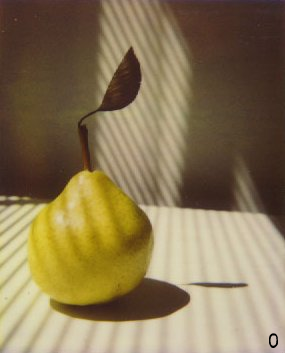

# Quant

Western University of Santa Catarina - UNOESC - Chapecó

Graduation Course in Computer Science

Work: Comparison Between Image Quantization Algorithms

Academic: Saulo Popov Zambiasi

Advisor: Marcos Vinícius Rayol Sobreiro

## Description

This project was the result of my Final Work for the Graduation Course in Computer Science at UNOESC - Chapecó in 1998. In this work I made a comparative study between some color image quantization algorithms. Quantize is the process of representing an image with M colors by another with N colors, where N < M.

The algorithms were implemented in C programming language and the visual and numerical results were used to compare them in the monograph. The chosen algorithms were:

* Quantization by mid cut
* Octree Quantization
* Quantization by double agglomerates

I updated the source code to be able to upload it to GitHub. At the time I used a proprietary graphics library to read and write the images. I replaced it with the SDL2 library. I also translated the comments, function names and various variables into English. In the rest, I didn't fix, I made corrections in the code and I didn't separate into files. The original program was just a big file and I left it that way. It was my first project in C programming language.

Maybe there are some bugs in the code, if you find something like that, feel free to send me correction suggestions.

## How To Use

This program aims to transform an image from N colors to M colors, where N > M, calculating the elapsed time. Three color image quantization algorithms are used.

Utilization:

`quant <img1.ext> <img2.ext> <colors> <algorithm>`

* `img1.ext` - original image with N colors.
* `img2.ext` - result image with M colors (N > M).
* `colors` - quantity of colors in img2.ext.
* `algorithm` - quantization algorithm:
  * `0` - Recursive Subdivision.
  * `1` - Octree.
  * `2` - Double Clusters.

Example:

`quant image.png result.png 256 0`

## Last Considerations

I confess that at the time I wanted to work with digital games in my Course Completion Work, but I didn't find an advisor available for that. Well, I got an advisor at Computer Graphics and I was very grateful for that, so I'm very grateful for Marcos who guided me at the time, even though he was at a distance, because he lived in Rio de Janeiro and I moved and attended university in Chapecó.
